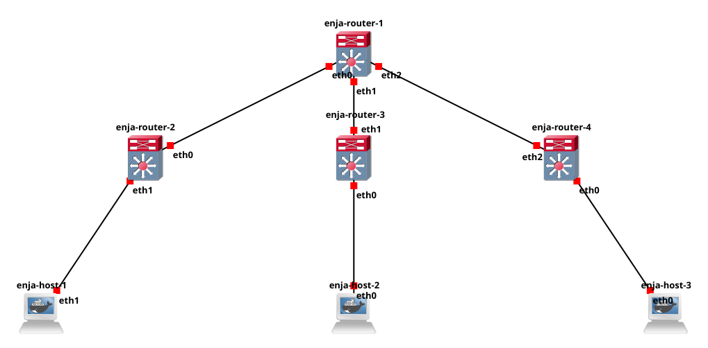

# BGP with EVPN



(BGP At Doors of Autonomous Systems is Simple) project, implementing a BGP EVPN network with VXLAN overlay for Layer 2 connectivity across a simulated data center topology.

## 📋 Table of Contents
- [Overview](#overview)
- [Requirements](#requirements)
- [Docker Images](#docker-images)
- [Network Topology](#network-topology)
- [IP Addressing Scheme](#ip-addressing-scheme)
- [Setup Instructions](#setup-instructions)
- [Configuration Files](#configuration-files)
- [Verification & Testing](#verification--testing)
- [How It Works](#how-it-works)
- [Troubleshooting](#troubleshooting)

## 🎯 Overview

This project demonstrates:
- **BGP EVPN** (Ethernet VPN) for control plane MAC learning
- **VXLAN** for Layer 2 overlay networking
- **OSPF** as the underlay routing protocol
- **Route Reflector** topology for BGP scalability
- Automatic MAC address distribution without multicast

### Network Architecture
```
                    enja-router-1 (Route Reflector)
                   /       |        \
                  /        |         \
        enja-router-2  enja-router-3  enja-router-4
           (VTEP)         (VTEP)         (VTEP)
             |              |              |
        enja-host-1    enja-host-2    enja-host-3
```

## 🛠️ Requirements

### Software Requirements
- **GNS3** (version 2.2.0 or higher)
  - For network topology simulation and management
  - Download: [GNS3 Official Site](https://www.gns3.com/software/download)
  
- **Docker** (version 20.10 or higher)
  - For container-based network devices
  - Ensure Docker is integrated with GNS3
  - Installation: [Docker Documentation](https://docs.docker.com/engine/install/)

- **GNS3 VM** (recommended) or local GNS3 server
  - Better performance and isolation
  - Built-in Docker support

### System Requirements
- **RAM**: Minimum 8GB (16GB recommended)
- **CPU**: Multi-core processor recommended
- **Disk Space**: At least 5GB free space
- **Operating System**: Linux, macOS, or Windows (with GNS3 VM)

## 🐳 Docker Images

This project uses two custom Docker images that must be built before starting:

### 1. Host Image (`Dockerfile.host`)
A lightweight container for simulating end hosts.

```dockerfile
FROM busybox
```

**Build command:**
```bash
docker build -t badass-host:latest -f Dockerfile.host .
```

**Features:**
- Minimal footprint based on BusyBox
- Basic networking utilities
- Used for: `enja-host-1`, `enja-host-2`, `enja-host-3`

### 2. Router Image (`Dockerfile.router`)
A FRRouting-based container with full routing capabilities.

```dockerfile
FROM frrouting/frr

RUN apk update && \
    apk add iproute2 bridge-utils busybox && \
    rm -rf /var/cache/apk/*

RUN sed -i 's/^bgpd=no/bgpd=yes/' /etc/frr/daemons && \
    sed -i 's/^ospfd=no/ospfd=yes/' /etc/frr/daemons && \
    sed -i 's/^isisd=no/isisd=yes/' /etc/frr/daemons
```

**Build command:**
```bash
docker build -t badass-router:latest -f Dockerfile.router .
```

**Features:**
- Based on FRRouting (FRR) - modern routing software suite
- **BGP** daemon enabled (for EVPN)
- **OSPF** daemon enabled (for underlay routing)
- **IS-IS** daemon enabled (optional, available if needed)
- **iproute2** for advanced networking (VXLAN, bridges)
- **bridge-utils** for bridge management
- Used for: `enja-router-1`, `enja-router-2`, `enja-router-3`, `enja-router-4`

### Building Both Images
```bash
# Navigate to project directory
cd /path/to/Bgp-At-Doors-of-Autonomous-Systems-is-Simple

# Build host image
docker build -t badass-host:latest -f Dockerfile.host .

# Build router image
docker build -t badass-router:latest -f Dockerfile.router .

# Verify images are built
docker images | grep badass
```

### Importing Images to GNS3
1. Open GNS3
2. Go to **Edit → Preferences → Docker containers**
3. Click **New**
4. Select **Existing image**
5. Choose `badass-router:latest` for routers
6. Set **Network adapters**: 4 (or as needed)
7. Repeat for `badass-host:latest` (1-2 adapters needed)
8. Configure console settings (keep default: telnet)

## 🗺️ Network Topology

### Device Roles
| Device | Role | Type | Interfaces Used |
|--------|------|------|-----------------|
| enja-router-1 | Route Reflector (Spine) | Router | lo, eth0, eth1, eth2 |
| enja-router-2 | VTEP (Leaf) | Router | lo, eth0, eth1 |
| enja-router-3 | VTEP (Leaf) | Router | lo, eth0, eth1 |
| enja-router-4 | VTEP (Leaf) | Router | lo, eth0, eth2 |
| enja-host-1 | End Host | Host | eth1 |
| enja-host-2 | End Host | Host | eth0 |
| enja-host-3 | End Host | Host | eth0 |

## 📡 IP Addressing Scheme

### Loopback Interfaces (VTEP IPs)
| Device | Loopback IP | Purpose |
|--------|-------------|---------|
| enja-router-1 | 1.1.1.1/32 | BGP Router ID, RR |
| enja-router-2 | 1.1.1.2/32 | BGP Router ID, VTEP Source |
| enja-router-3 | 1.1.1.3/32 | BGP Router ID, VTEP Source |
| enja-router-4 | 1.1.1.4/32 | BGP Router ID, VTEP Source |

### Point-to-Point Links (Underlay Network)
| Link | Router 1 Interface | IP Address | Router 2 Interface | IP Address |
|------|-------------------|------------|-------------------|------------|
| Link 1 | enja-router-1 eth0 | 10.1.1.1/30 | enja-router-2 eth0 | 10.1.1.2/30 |
| Link 2 | enja-router-1 eth1 | 10.1.1.5/30 | enja-router-3 eth1 | 10.1.1.6/30 |
| Link 3 | enja-router-1 eth2 | 10.1.1.9/30 | enja-router-4 eth2 | 10.1.1.10/30 |

### Host Network (Overlay/VXLAN)
| Host | IP Address | Connected to |
|------|------------|--------------|
| enja-host-1 | 192.168.1.1/24 | enja-router-2 eth1 |
| enja-host-2 | 192.168.1.2/24 | enja-router-3 eth0 |
| enja-host-3 | 192.168.1.3/24 | enja-router-4 eth0 |

### VXLAN Parameters
- **VNI (VXLAN Network Identifier)**: 10
- **UDP Port**: 4789 (VXLAN default)
- **Bridge Name**: br0 (on all VTEPs)
- **VXLAN Interface**: vxlan10 (on all VTEPs)

## 🚀 Setup Instructions

### Step 1: Build Docker Images
```bash
# Build both Docker images (see Docker Images section above)
docker build -t badass-host:latest -f Dockerfile.host .
docker build -t badass-router:latest -f Dockerfile.router .
```

### Step 2: Import to GNS3
1. Import both Docker images to GNS3
2. Create the topology as shown in the diagram
3. Connect devices according to the topology

### Step 3: Configure Route Reflector (enja-router-1)
```bash
# Double-click on enja-router-1 in GNS3 to open console
# Copy and paste commands from P3/enja-router-1.txt

# Configure interfaces
ip addr add 1.1.1.1/32 dev lo
ip addr add 10.1.1.1/30 dev eth0
ip addr add 10.1.1.5/30 dev eth1
ip addr add 10.1.1.9/30 dev eth2
ip link set dev lo up
ip link set dev eth0 up
ip link set dev eth1 up
ip link set dev eth2 up

# Configure FRR
vtysh
configure terminal
# ... (paste FRR configuration from file)
```

### Step 4: Configure VTEPs (enja-router-2, 3, 4)
For each VTEP router, follow the configuration in respective `.txt` files:
1. Configure interfaces and loopback
2. Create bridge `br0`
3. Create VXLAN interface with VNI 10
4. Configure OSPF for underlay
5. Configure BGP EVPN for overlay

Example for enja-router-2:
```bash
# See P3/enja-router-2.txt for complete configuration
ip addr add 1.1.1.2/32 dev lo
ip addr add 10.1.1.2/30 dev eth0
ip link add br0 type bridge
ip link add vxlan10 type vxlan id 10 dstport 4789 local 1.1.1.2 nolearning
# ... (continue with configuration)
```

### Step 5: Configure Hosts
```bash
# On each host, configure IP address
# enja-host-1:
ip addr add 192.168.1.1/24 dev eth1
ip link set dev eth1 up

# enja-host-2:
ip addr add 192.168.1.2/24 dev eth0
ip link set dev eth0 up

# enja-host-3:
ip addr add 192.168.1.3/24 dev eth0
ip link set dev eth0 up
```

## 📁 Configuration Files

All configuration files are located in the `P3/` directory:

- **enja-router-1.txt** - Route Reflector configuration
- **enja-router-2.txt** - VTEP 2 configuration  
- **enja-router-3.txt** - VTEP 3 configuration
- **enja-router-4.txt** - VTEP 4 configuration
- **enja-host-1.txt** - Host 1 configuration
- **enja-host-2.txt** - Host 2 configuration
- **enja-host-3.txt** - Host 3 configuration

Each file contains:
- Interface configuration commands
- Bridge and VXLAN setup (for VTEPs)
- FRR/vtysh configuration
- Detailed comments explaining each step

## ✅ Verification & Testing

### 1. Check OSPF Neighbors
```bash
# On any router
vtysh -c "show ip ospf neighbor"
```
**Expected**: All routers should see their OSPF neighbors as FULL.

### 2. Check BGP EVPN Peering
```bash
# On Route Reflector (enja-router-1)
vtysh -c "show bgp l2vpn evpn summary"
```
**Expected**: All 3 VTEPs should show as Established.

### 3. Check EVPN Routes

#### Type 3 Routes (IMET - Inclusive Multicast Ethernet Tag)
```bash
vtysh -c "show bgp l2vpn evpn route type 3"
```
**Expected**: Should see Type 3 routes from all VTEPs advertising VNI 10.

#### Type 2 Routes (MAC/IP Advertisement)
```bash
vtysh -c "show bgp l2vpn evpn route type 2"
```
**Expected**: Should see Type 2 routes with MAC addresses of active hosts.

### 4. Check VXLAN Interface
```bash
# On any VTEP
ip -d link show vxlan10
```
**Expected**: Should show VXLAN interface with VNI 10, local IP, and nolearning flag.

### 5. Check Bridge FDB (Forwarding Database)
```bash
# On any VTEP
bridge fdb show dev vxlan10
```
**Expected**: Should show MAC addresses learned from remote VTEPs.

### 6. Check MAC Address Learning
```bash
# On any VTEP
vtysh -c "show evpn mac vni 10"
```
**Expected**: Should show local and remote MAC addresses.

### 7. Test Host Connectivity
```bash
# From enja-host-1
ping 192.168.1.2
ping 192.168.1.3
```
**Expected**: Successful ping responses from all hosts.

### 8. Capture VXLAN Traffic
```bash
# On any router interface
tcpdump -i eth0 -n udp port 4789 -v
```
**Expected**: Should see VXLAN encapsulated packets with VNI 10 and ICMP traffic.

## 🔍 How It Works

### 1. Underlay Network (OSPF)
- OSPF establishes IP reachability between all router loopback addresses
- All routers are in OSPF Area 0
- This creates the transport network for BGP and VXLAN tunnels

### 2. Overlay Control Plane (BGP EVPN)
- BGP uses loopback IPs for peering (stable identifiers)
- Route Reflector (RR) simplifies topology - VTEPs only peer with RR
- When a host comes online, the VTEP learns its MAC address
- VTEP advertises Type 2 route (MAC/IP) to Route Reflector
- RR reflects this route to all other VTEPs
- Remote VTEPs install MAC address in their forwarding database

### 3. Overlay Data Plane (VXLAN)
- Each VTEP has a bridge (br0) connecting local hosts and VXLAN interface
- VXLAN interface uses loopback IP as source (VTEP IP)
- When a host sends traffic, it enters the bridge
- Bridge forwards to VXLAN interface based on MAC address
- VXLAN encapsulates Layer 2 frame in UDP/IP packet
- Packet is sent to remote VTEP's loopback IP (learned from BGP)
- Remote VTEP decapsulates and forwards to destination host

### 4. Route Types in BGP EVPN
- **Type 3 (IMET - Inclusive Multicast Ethernet Tag)**
  - Advertises VTEP participation in a VNI
  - Always present when VNI is configured
  - Contains VTEP's IP address (loopback)
  
- **Type 2 (MAC/IP Advertisement)**
  - Advertises host MAC addresses (and optionally IP)
  - Created dynamically when hosts are active
  - Contains MAC address, VNI, and advertising VTEP IP

### 5. The "nolearning" Flag
- Disables traditional data-plane MAC learning on VXLAN interface
- Forces all MAC learning to happen via BGP EVPN (control-plane)
- Provides better control, visibility, and troubleshooting

## 🔧 Troubleshooting

### BGP Session Not Establishing
**Symptoms**: BGP neighbors show as "Active" or "Connect"

**Solutions**:
1. Check OSPF is working:
   ```bash
   vtysh -c "show ip ospf neighbor"
   ```
2. Verify loopback reachability:
   ```bash
   ping 1.1.1.1 -I lo
   ```
3. Check BGP configuration:
   ```bash
   vtysh -c "show running-config"
   ```
4. Ensure loopback IPs are advertised in OSPF

### No Type 2 Routes Appearing
**Symptoms**: Only Type 3 routes visible, no MAC addresses learned

**Solutions**:
1. Ensure hosts are active and have generated traffic (ping between hosts)
2. Check bridge configuration:
   ```bash
   bridge link show
   ```
3. Verify host interface is in bridge:
   ```bash
   bridge link show master br0
   ```
4. Verify VXLAN is in bridge:
   ```bash
   bridge link show dev vxlan10
   ```
5. Check if MAC addresses are learned locally:
   ```bash
   bridge fdb show br0
   ```

### Hosts Cannot Communicate
**Symptoms**: Ping fails between hosts

**Solutions**:
1. Verify host IP configuration:
   ```bash
   ip addr show
   ```
2. Check all hosts are in same subnet (192.168.1.0/24)
3. Ensure VXLAN VNI matches on all VTEPs (VNI 10)
4. Check MAC learning:
   ```bash
   vtysh -c "show evpn mac vni 10"
   ```
5. Capture traffic to see if VXLAN encapsulation is working:
   ```bash
   tcpdump -i eth0 -n
   ```
6. Verify bridge is up:
   ```bash
   ip link show br0
   ```

### VXLAN Interface Not Working
**Symptoms**: VXLAN interface down or not forwarding

**Solutions**:
1. Check VXLAN interface is up:
   ```bash
   ip link show vxlan10
   ```
2. Verify VXLAN parameters:
   ```bash
   ip -d link show vxlan10
   ```
3. Ensure local IP matches loopback:
   ```bash
   ip addr show lo
   ```
4. Check UDP port 4789 is not blocked

### OSPF Neighbors Not Coming Up
**Symptoms**: No OSPF neighbors visible

**Solutions**:
1. Check interface is up:
   ```bash
   ip link show
   ```
2. Verify OSPF is enabled:
   ```bash
   vtysh -c "show ip ospf interface"
   ```
3. Check network statements in OSPF configuration
4. Ensure interfaces have correct IP addresses

## 📚 Technologies Used

- **FRRouting (FRR)**: Modern routing protocol suite
- **BGP EVPN (RFC 7432)**: Ethernet VPN for MAC address distribution
- **VXLAN (RFC 7348)**: Virtual Extensible LAN for Layer 2 overlay
- **OSPF**: Open Shortest Path First for underlay routing
- **Docker**: Container platform for network devices
- **GNS3**: Network simulation and emulation platform

## 📖 References

- [RFC 7432 - BGP MPLS-Based Ethernet VPN](https://datatracker.ietf.org/doc/html/rfc7432)
- [RFC 7348 - VXLAN](https://datatracker.ietf.org/doc/html/rfc7348)
- [FRRouting Documentation](https://docs.frrouting.org/)
- [GNS3 Documentation](https://docs.gns3.com/)

## 📝 License

This project is part of the BADASS (BGP At Doors of Autonomous Systems is Simple) educational curriculum.

---

**Note**: Replace "enja" with your own login/username as required by the project specifications.
